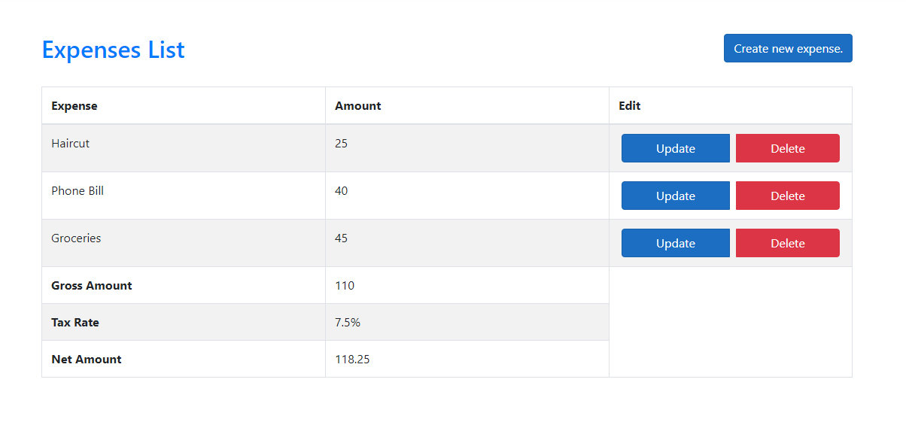

Expense tracker with user authentication built using ASP.NET Core MVC in .NET 5.0. Data is managed using Entity Framework Core and SQL Server.

User can perform CRUD operations on list of expenses. 

Form designed using bootstrap components. 

User login required in-order to view/modify the data.

